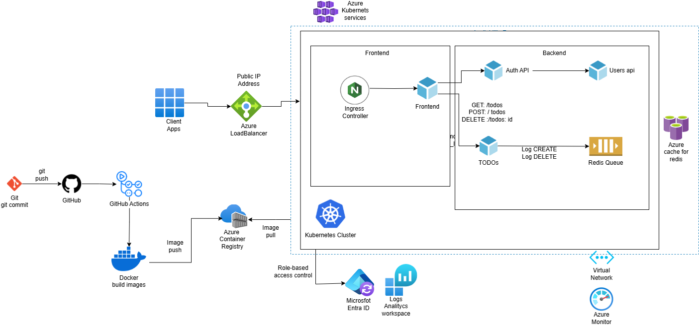

# Documentación Técnica – Proyecto DevOps en AKS

## Repositorios de Partida

Este proyecto parte del repositorio original:

- https://github.com/bortizf/microservice-app-example.git

Desde este punto, se avanzó tomando como base el repositorio de una de las integrantes del equipo:

- https://github.com/Vanesa155/microservice-kubernetes.git

Este segundo repositorio contiene una implementación funcional de despliegue de microservicios con Docker. Cada microservicio cuenta con su propio `Dockerfile`, lo cual permite la construcción independiente de sus respectivas imágenes. Para facilitar el despliegue local, se incluye un script en Bash que construye y ejecuta los contenedores dentro de una red personalizada.

## Infraestructura en Azure

Antes de automatizar el despliegue, se debe preparar la infraestructura necesaria:

### 1. Crear Azure Container Registry (ACR)
```ps
az acr create --resource-group <resource_group_name> --name <acr_name> --sku Basic
```
Un Azure Container Registry es un registro privado de imágenes Docker, donde puedes:
Push de imágenes desde tu máquina local o CI/CD.


Pull desde tus clústeres de Kubernetes (como AKS).


Integrarlo con GitHub Actions, Azure Pipelines, etc.


### 2. Crear Azure Kubernetes Service (AKS)
```ps
az aks create --resource-group <resource_group_name> --name <cluster_name> --node-count 1 --generate-ssh-keys --attach-acr <acr_name>
```

crea un Azure Kubernetes Service (AKS) y lo vincula automáticamente con tu Azure Container Registry (ACR)

¿Qué significa “attach-acr”?
Sin --attach-acr, tendrías que configurar permisos manuales para que AKS pueda acceder a tu ACR.
Con --attach-acr automationrepository, Azure:
Crea una relación de confianza entre el Service Principal de AKS y tu ACR.


Así, Kubernetes puede tirar imágenes directamente desde automationrepository.azurecr.io sin configuraciones extras.


### 3. Dar permisos al AKS para usar el ACR
```bash
az aks update --name <nombre-del-cluster> \
              --resource-group <nombre-del-rg> \
              --attach-acr <nombre-del-acr>
```
crea un Service Principal (SP) en Azure Active Directory y lo asigna a un rol de acceso (RBAC) dentro de un alcance específico
Este comando es comúnmente utilizado para configurar autenticación automática en CI/CD, por ejemplo:
GitHub Actions necesita autenticarse con Azure para desplegar infraestructura o aplicaciones.


Se genera un Service Principal con los permisos necesarios (en este caso, Contributor en un grupo de recursos).


El JSON que devuelve --sdk-auth se guarda como un secreto en GitHub (AZURE_CREDENTIALS), y luego se usa en los workflows con azure/login.
*Settings > Secrets and variables > Actions > New secret.*


---

## Estrategia DevOps Implementada

### Automatización con GitHub Actions
Se ha configurado un flujo de CI/CD usando GitHub Actions. Este flujo se activa automáticamente al hacer un `push` sobre la rama `main` y realiza las siguientes acciones:

- Autenticación con Azure usando `azure/login@v1`
- Construcción de imágenes Docker para cada microservicio
- Publicación en Azure Container Registry (ACR)
- Conexión con el clúster AKS
- Aplicación de manifiestos Kubernetes con `kubectl apply`
- Exposición del frontend con un servicio tipo `LoadBalancer`

### Archivo utilizado:
- `.github/workflows/deploy.yml`

### Manifiestos Kubernetes:
- `k8s/microservices-deployment.yaml`

## Arquitectura Modular con Kubernetes

El archivo `microservices-deployment.yaml` contiene los objetos `Deployment` y `Service` para los siguientes microservicios:

| Microservicio  | Imagen Docker                            | Tipo de Servicio | Puerto expuesto |
|----------------|-------------------------------------------|------------------|-----------------|
| Redis          | redis-image                              | ClusterIP        | 6379            |
| Zipkin         | zipkin-image                             | ClusterIP        | 9411            |
| Users API      | usersapi-image                           | ClusterIP        | 8083            |
| Auth API       | authapi-image                            | ClusterIP        | 8000            |
| Todos API      | todosapi-image                           | ClusterIP        | 8082            |
| Frontend       | frontend-image                           | LoadBalancer     | 80 → 8080     |

> ⚠️ El frontend se publica externamente mediante IP pública, accesible desde cualquier navegador.

---

## Estrategia de Branching

### Para Infraestructura: Trunk Based Development (TBD)
Esta estrategia implica trabajar directamente sobre la rama `main`. Las ventajas que aporta son:

- Ciclos de integración más cortos
- Automatización efectiva del pipeline
- Reducción de conflictos en los cambios
- Flujo más simple y rápido

Esto es ideal para la infraestructura, ya que los cambios suelen ser pequeños y deben aplicarse continuamente.

### Para Desarrollo de Aplicaciones: Feature Branches
Para el desarrollo de APIs o frontend, se sugiere el uso de ramas cortas basadas en `main`, como:

- `main ← auth-login-feature`
- `main ← fix-todo-validation`

Estas ramas deben:

- Crearse desde `main`
- Ser fusionadas por Pull Request
- Tener una vida corta (ideal: < 2 días)

---

## Metodología Ágil: Kanban

Se ha adoptado la metodología Kanban para la organización de tareas del equipo. Las razones principales son:

- Visualización clara del flujo de trabajo
- Mejora en la gestión del WIP (trabajo en curso)
- Adaptabilidad a tareas de infraestructura y mantenimiento
- Ideal para flujos continuos como DevOps


 https://trello.com/invite/b/680296aa17864e87fc6c7fed/ATTI1f7653c359f8f014c9a31480c209dc9912CB45C2/microservice
 
### Herramienta: GitHub Projects
Columnas:
- To Do
- In Progress
- Done

---

## Diagrama de Arquitectura

